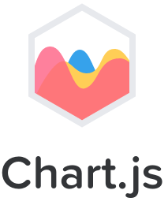

# ECB-CSE
Repository for our summer training Project

Thanks <a href="http://www.rrscw.nrsc.gov.in/" title="RRSC-W">RRSC-W </a>to give an opportunity as Trainee.

Our Group Number is <b>C08</b> and We work under guidance of Gaurav Sir.
He is working as <b>Scientist/Engineer 'SE'</b> at RRSC-W, Jodhpur.

Our Project is <b>Cearting Web Application Using HTML5.</b> 
Firstly We cover 6 steps: 
1: Show map layers 
2: Show manual pointed points on map 
3: Find user's location 
4: Generate pop-up to click on particular points 
5: Search places  
6: Show the Temperature on particular points 

We cover all the steps using <a href="http://openlayers.org/">OpenLayer map API</a>.  
 
<b>OpenLayers</b> is an open source (provided under the 2-clause BSD License) JavaScript library for displaying map data in web browsers. It provides an API for building rich web-based geographic applications similar to Google Maps and Bing Maps. The library was originally based on the Prototype JavaScript Framework. 
OpenLayers was created by MetaCarta after the O'Reilly Where 2.0 conference of June 29–30, 2005, and released as open source software before the Where 2.0 conference of June 13–14, 2006, by MetaCarta Labs. Two other open-source mapping tools released by MetaCarta are FeatureServer and TileCache. Since November 2007, OpenLayers has been an Open Source Geospatial Foundation project.  

And Step 6 cover using <a href="http://www.chartjs.org/">chart.js</a>. 
 
<b>Chart.js</b> is a javascript library that can be used to easily create animated, interactive graphs to include on web pages. Chart.js uses the HTML5 canvas element and is responsive. Chart.js supports Line, Bar, Radar, Polar Area, Pie and Doughnut charts and includes options to extend these chart types and write new ones.  

After these step We move forward with chart.js. We collected the Temperature and Humidity data from our friends, who has Electronics Project at RRSC-W and show these data on map with particular location. In this step we store all data at our PHP server. Every sensor collecte the new data in between 5 min and update on server and map.

Please visit our project map, To follow belove link
<a href="https://ravirajpurohit.github.io/Error">ECB-CSE Project</a>

Thank you
<a herf="https://github.com/RaviRajpurohit">Ravi Rajpurohit</a> 
<a herf="https://www.facebook.com/ravi4255">Ravi Saini</a> 
<a herf="https://www.facebook.com/profile.php?id=100007113045423&fref=ts">Ruchika Kachhawa</a> 
<a herf="https://www.facebook.com/rachana.bahety.37?fref=ts">Rachana Bahety</a> 
<a herf="https://www.facebook.com/nikhilsomaniecb">Nikhil Somani</a> 
<a herf="https://www.facebook.com/ddcharandasoori">Dungar Dan Charan</a> 
<a herf="https://www.facebook.com/SMohitjain94">Mohit Bohara</a> 
